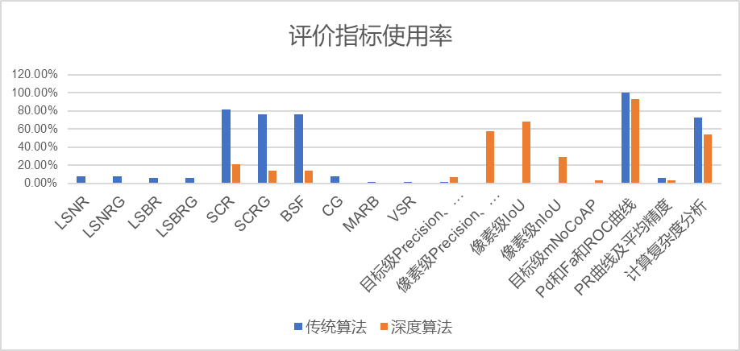

# Overview of the statistics
<table align="center">
  <tbody>
<tr align="center" valign="top">
        <td><b>No.</b></td>
        <td><b>Year</b></td>
        <td><b>Algorithm category</b></td>
        <td><b>Task format</b></td>
        <td><b>Title</b></td>
        <td><b>Journal name</b></td>
        <td><b>doi</b></td>
        <td><b>SCR</b></td>
        <td><b>SCRG</b></td>
        <td><b>BSF</b></td>
        <td><b>VSR</b></td>
        <td><b>MARB</b></td>
        <td><b>CG</b></td>
        <td><b>LSNRG</b></td>
        <td><b>LSBRG</b></td>
        <td><b>Target-level Precision、Recall、F1</b></td>
        <td><b>Pixel-level Precision、Recall、F1</b></td>
        <td><b>Pixel-level IoU</b></td>
        <td><b>Pixel-level nIoU</b></td>
        <td><b>mNoCoAP</b></td>
        <td><b>PR curve and average precision</b></td>
        <td><b>Pd,Fa and ROC curves</b></td>
        <td><b>The calculation method of Pd</b></td>
        <td><b>Does the paper include the calculation details of TP?</b></td>
        <td><b>Specific details</b></td>
        <td><b>Computational complexity analysis</b></td>
    </tr>
    <tr align="center" valign="top">
        <td>1</td>
        <td>2015</td>
        <td>Traditional algorithm</td>
        <td>segmentation</td>
        <td>Adaptive method for the detection of infrared small target</td>
        <td>Optical Engineering</td>
        <td>10.1117/1.OE.54.11.113107</td>
        <td>√</td>
        <td>√</td>
        <td>√</td>
        <td>×</td>
        <td>×</td>
        <td>×</td>
        <td>×</td>
        <td>×</td>
        <td>×</td>
        <td>×</td>
        <td>×</td>
        <td>×</td>
        <td>×</td>
        <td>×</td>
        <td>√</td>
        <td>Center-level TP</td>
        <td>×</td>
        <td></td>
        <td>√</td>
    </tr>
    <tr align="center" valign="top">
        <td>2</td>
        <td>2019</td>
        <td>Traditional algorithm </td>
        <td>segmentation</td>
        <td>Infrared small target detection based on adaptive double-layer TDLMS filter</td>
        <td>Acta photonica sinica</td>
        <td>10.3788/gzxb20194809.0910001</td>
        <td>√</td>
        <td>√</td>
        <td>√</td>
        <td>×</td>
        <td>×</td>
        <td>×</td>
        <td>×</td>
        <td>×</td>
        <td>×</td>
        <td>×</td>
        <td>×</td>
        <td>×</td>
        <td>×</td>
        <td>×</td>
        <td>√</td>
        <td>Pixel-level TP</td>
        <td>×</td>
        <td></td>
        <td>√</td>
    </tr>
    <tr align="center" valign="top">
        <td>3</td>
        <td>2019</td>
        <td>Traditional algorithm </td>
        <td>segmentation</td>
        <td>Infrared Small Target Detection Based on Spatial-Temporal Enhancement Using Quaternion Discrete Cosine Transform</td>
        <td>IEEE Access</td>
        <td>10.1109/ACCESS.2019.2912976</td>
        <td>√</td>
        <td>√</td>
        <td>√</td>
        <td>×</td>
        <td>×</td>
        <td>×</td>
        <td>×</td>
        <td>×</td>
        <td>×</td>
        <td>×</td>
        <td>×</td>
        <td>×</td>
        <td>×</td>
        <td>×</td>
        <td>√</td>
        <td>Center-level TP</td>
        <td>×</td>
        <td></td>
        <td>√</td>
    </tr>
    <tr align="center" valign="top">
        <td>4</td>
        <td>2022</td>
        <td>Traditional algorithm </td>
        <td>segmentation</td>
        <td>Infrared Small Target Detection Utilizing Halo Structure Prior-Based Local Contrast Measure</td>
        <td>IEEE Geoscience and Remote Sensing Letters</td>
        <td>10.1109/LGRS.2022.3162390</td>
        <td>√</td>
        <td>√</td>
        <td>√</td>
        <td>×</td>
        <td>×</td>
        <td>×</td>
        <td>×</td>
        <td>×</td>
        <td>×</td>
        <td>×</td>
        <td>×</td>
        <td>×</td>
        <td>×</td>
        <td>×</td>
        <td>√</td>
        <td>Center-level TP</td>
        <td>×</td>
        <td></td>
        <td>√</td>
    </tr>
    <tr align="center" valign="top">
        <td>5</td>
        <td>2021</td>
        <td>Traditional algorithm </td>
        <td>segmentation</td>
        <td>Infrared Small-Target Detection Based on Multiple Morphological Profiles</td>
        <td>IEEE Transactions on Geoscience and Remote Sensing</td>
        <td>10.1109/TGRS.2020.3022863</td>
        <td>√</td>
        <td>√</td>
        <td>√</td>
        <td>×</td>
        <td>×</td>
        <td>×</td>
        <td>×</td>
        <td>×</td>
        <td>×</td>
        <td>×</td>
        <td>×</td>
        <td>×</td>
        <td>×</td>
        <td>×</td>
        <td>√</td>
        <td>Pixel-level TP</td>
        <td>×</td>
        <td></td>
        <td>√</td>
    </tr>
    <tr align="center" valign="top">
        <td>6</td>
        <td>2015</td>
        <td>Traditional algorithm </td>
        <td>segmentation</td>
        <td>Adaptive detection method of infrared small target based on target-background separation via robust principal component analysis</td>
        <td>Infrared Physics &amp; Technology</td>
        <td>10.1016/j.infrared.2015.01.017</td>
        <td>√</td>
        <td>√</td>
        <td>√</td>
        <td>×</td>
        <td>×</td>
        <td>×</td>
        <td>×</td>
        <td>×</td>
        <td>×</td>
        <td>×</td>
        <td>×</td>
        <td>×</td>
        <td>×</td>
        <td>×</td>
        <td>√</td>
        <td>Center-level TP</td>
        <td>×</td>
        <td></td>
        <td>×</td>
    </tr>
    <tr align="center" valign="top">
        <td>7</td>
        <td>2023</td>
        <td>Traditional algorithm </td>
        <td>segmentation</td>
        <td>Combining Deep Denoiser and Low-rank Priors for Infrared Small Target Detection</td>
        <td>Pattern Recognition</td>
        <td>10.1016/j.patcog.2022.109184</td>
        <td>√</td>
        <td>×</td>
        <td>×</td>
        <td>×</td>
        <td>×</td>
        <td>√</td>
        <td>×</td>
        <td>×</td>
        <td>×</td>
        <td>×</td>
        <td>×</td>
        <td>×</td>
        <td>×</td>
        <td>×</td>
        <td>√</td>
        <td>Center-level TP</td>
        <td>×</td>
        <td></td>
        <td>√</td>
    </tr>
    <tr align="center" valign="top">
        <td>8</td>
        <td>2019</td>
        <td>Traditional algorithm </td>
        <td>segmentation</td>
        <td>Detection of Small Target Using Schatten 1/2 Quasi-Norm Regularization with Reweighted Sparse Enhancement in Complex Infrared Scenes</td>
        <td>Remote Sensing</td>
        <td>10.1016/j.patcog.2022.109184</td>
        <td>√</td>
        <td>√</td>
        <td>√</td>
        <td>×</td>
        <td>×</td>
        <td>×</td>
        <td>√</td>
        <td>×</td>
        <td>×</td>
        <td>×</td>
        <td>×</td>
        <td>×</td>
        <td>×</td>
        <td>×</td>
        <td>√</td>
        <td>Center-level TP</td>
        <td>×</td>
        <td></td>
        <td>√</td>
    </tr>
    <tr align="center" valign="top">
        <td>9</td>
        <td>2017</td>
        <td>Traditional algorithm </td>
        <td>segmentation</td>
        <td>Infrared Dim and Small Target Detection Based on Stable Multisubspace Learning in Heterogeneous Scene</td>
        <td>IEEE Transactions on Geoscience and Remote Sensing</td>
        <td>10.1109/TGRS.2017.2709250</td>
        <td>√</td>
        <td>√</td>
        <td>√</td>
        <td>×</td>
        <td>×</td>
        <td>×</td>
        <td>×</td>
        <td>×</td>
        <td>×</td>
        <td>×</td>
        <td>×</td>
        <td>×</td>
        <td>×</td>
        <td>×</td>
        <td>√</td>
        <td>Center-level TP</td>
        <td>×</td>
        <td></td>
        <td>√</td>
    </tr>
    <tr align="center" valign="top">
        <td>10</td>
        <td>2017</td>
        <td>Traditional algorithm </td>
        <td>segmentation</td>
        <td>Infrared dim target detection based on total variation regularization and principal component pursuit</td>
        <td>Image and Vision Computing</td>
        <td>10.1016/j.imavis.2017.04.002</td>
        <td>√</td>
        <td>√</td>
        <td>√</td>
        <td>×</td>
        <td>×</td>
        <td>×</td>
        <td>×</td>
        <td>×</td>
        <td>×</td>
        <td>×</td>
        <td>×</td>
        <td>×</td>
        <td>×</td>
        <td>×</td>
        <td>√</td>
        <td>Center-level TP</td>
        <td>×</td>
        <td></td>
        <td>×</td>
    </tr>
    <tr align="center" valign="top">
        <td>11</td>
        <td>2013</td>
        <td>Traditional algorithm </td>
        <td>segmentation</td>
        <td>Infrared Patch-Image Model for Small Target Detection in a Single Image</td>
        <td>IEEE Transactions on Image Processing</td>
        <td>10.1109/TIP.2013.2281420</td>
        <td>√</td>
        <td>√</td>
        <td>√</td>
        <td>×</td>
        <td>×</td>
        <td>×</td>
        <td>×</td>
        <td>×</td>
        <td>×</td>
        <td>×</td>
        <td>×</td>
        <td>×</td>
        <td>×</td>
        <td>×</td>
        <td>√</td>
        <td>Center-level TP</td>
        <td>√</td>
        <td>To be judged as a real target, two requirements must be met simultaneously: (i) the pixels of the predicted target and the real target overlap; (ii) The Euclidean distance between the predicted target centroid and the true target centroid is less than or equal to 4</td>
        <td>√</td>
    </tr>
    <tr align="center" valign="top">
        <td>12</td>
        <td>2016</td>
        <td>Traditional algorithm </td>
        <td>segmentation</td>
        <td>Infrared small moving target detection using sparse representation-based image decomposition</td>
        <td>Infrared Physics &amp; Technology</td>
        <td>10.1016/j.infrared.2016.02.003</td>
        <td>√</td>
        <td>√</td>
        <td>√</td>
        <td>×</td>
        <td>×</td>
        <td>×</td>
        <td>×</td>
        <td>×</td>
        <td>×</td>
        <td>×</td>
        <td>×</td>
        <td>×</td>
        <td>×</td>
        <td>×</td>
        <td>√</td>
        <td>Center-level TP</td>
        <td>×</td>
        <td></td>
        <td>×</td>
    </tr>
    <tr align="center" valign="top">
        <td>13</td>
        <td>2019</td>
        <td>Traditional algorithm </td>
        <td>segmentation</td>
        <td>Infrared small target detection based on an image-patch tensor model</td>
        <td>Infrared Physics &amp; Technology</td>
        <td>10.1016/j.infrared.2019.03.009</td>
        <td>√</td>
        <td>√</td>
        <td>√</td>
        <td>×</td>
        <td>×</td>
        <td>×</td>
        <td>×</td>
        <td>×</td>
        <td>×</td>
        <td>×</td>
        <td>×</td>
        <td>×</td>
        <td>×</td>
        <td>×</td>
        <td>√</td>
        <td>Center-level TP</td>
        <td>×</td>
        <td></td>
        <td>×</td>
    </tr>
    <tr align="center" valign="top">
        <td>14</td>
        <td>2020</td>
        <td>Traditional algorithm </td>
        <td>segmentation</td>
        <td>Infrared Small Target Detection Based on Low Rank Sparse Decomposition in Gaussian Space</td>
        <td>Computer Science and Application </td>
        <td>10.12677/csa.2020.105099</td>
        <td>√</td>
        <td>√</td>
        <td>√</td>
        <td>×</td>
        <td>×</td>
        <td>×</td>
        <td>×</td>
        <td>×</td>
        <td>×</td>
        <td>×</td>
        <td>×</td>
        <td>×</td>
        <td>×</td>
        <td>×</td>
        <td>√</td>
        <td>Pixel-level TP</td>
        <td>×</td>
        <td></td>
        <td>×</td>
    </tr>
    <tr align="center" valign="top">
        <td>15</td>
        <td>2019</td>
        <td>Traditional algorithm </td>
        <td>segmentation</td>
        <td>Infrared Small Target Detection Based on Non-Convex Optimization with Lp-Norm Constraint</td>
        <td>Remote Sensing</td>
        <td>10.3390/rs11050559</td>
        <td>√</td>
        <td>√</td>
        <td>√</td>
        <td>×</td>
        <td>×</td>
        <td>×</td>
        <td>×</td>
        <td>×</td>
        <td>×</td>
        <td>×</td>
        <td>×</td>
        <td>×</td>
        <td>×</td>
        <td>×</td>
        <td>√</td>
        <td>Pixel-level TP</td>
        <td>×</td>
        <td></td>
        <td>×</td>
    </tr>
    <tr align="center" valign="top">
        <td>16</td>
        <td>2019</td>
        <td>Traditional algorithm </td>
        <td>segmentation</td>
        <td>Infrared Small Target Detection Based on Partial Sum of the Tensor Nuclear Norm</td>
        <td>Remote Sensing</td>
        <td>10.3390/rs11040382</td>
        <td>√</td>
        <td>√</td>
        <td>√</td>
        <td>×</td>
        <td>×</td>
        <td>×</td>
        <td>×</td>
        <td>×</td>
        <td>×</td>
        <td>×</td>
        <td>×</td>
        <td>×</td>
        <td>×</td>
        <td>×</td>
        <td>√</td>
        <td>Unable to determine</td>
        <td>×</td>
        <td></td>
        <td>√</td>
    </tr>
    <tr align="center" valign="top">
        <td>17</td>
        <td>2017</td>
        <td>Traditional algorithm </td>
        <td>segmentation</td>
        <td>Infrared small target detection in heavy sky scene clutter based on sparse representation</td>
        <td>Infrared Physics &amp; Technology</td>
        <td>10.1016/j.infrared.2017.05.009</td>
        <td>√</td>
        <td>×</td>
        <td>×</td>
        <td>×</td>
        <td>√</td>
        <td>×</td>
        <td>×</td>
        <td>×</td>
        <td>×</td>
        <td>×</td>
        <td>×</td>
        <td>×</td>
        <td>×</td>
        <td>×</td>
        <td>√</td>
        <td>Pixel-level TP</td>
        <td>×</td>
        <td></td>
        <td>√</td>
    </tr>
    <tr align="center" valign="top">
        <td>18</td>
        <td>2019</td>
        <td>Traditional algorithm </td>
        <td>segmentation</td>
        <td>Infrared Small Target Detection Using Local and Nonlocal Spatial Information</td>
        <td>IEEE Journal of Selected Topics in Applied Earth Observations and Remote Sensing</td>
        <td>10.1109/JSTARS.2019.2931566</td>
        <td>√</td>
        <td>√</td>
        <td>√</td>
        <td>×</td>
        <td>×</td>
        <td>×</td>
        <td>×</td>
        <td>×</td>
        <td>×</td>
        <td>×</td>
        <td>×</td>
        <td>×</td>
        <td>×</td>
        <td>×</td>
        <td>√</td>
        <td>Center-level TP</td>
        <td>√</td>
        <td>To be judged as a real target, two requirements must be met simultaneously: (i) the pixels of the predicted target and the real target overlap; (ii) The Euclidean distance between the predicted target centroid and the true target centroid is less than or equal to 5</td>
        <td>√</td>
    </tr>
    <tr align="center" valign="top">
        <td>19</td>
        <td>2020</td>
        <td>Traditional algorithm </td>
        <td>segmentation</td>
        <td>Infrared Small Target Detection via Non-Convex Tensor Rank Surrogate Joint Local Contrast Energy</td>
        <td>Remote Sensing</td>
        <td>10.3390/rs12091520</td>
        <td>√</td>
        <td>√</td>
        <td>√</td>
        <td>×</td>
        <td>×</td>
        <td>×</td>
        <td>×</td>
        <td>×</td>
        <td>×</td>
        <td>×</td>
        <td>×</td>
        <td>×</td>
        <td>×</td>
        <td>×</td>
        <td>√</td>
        <td>Center-level TP</td>
        <td>×</td>
        <td></td>
        <td>√</td>
    </tr>
    <tr align="center" valign="top">
        <td>20</td>
        <td>2017</td>
        <td>Traditional algorithm </td>
        <td>segmentation</td>
        <td>Reweighted Infrared Patch-Tensor Model With Both Nonlocal and Local Priors for Single-Frame Small Target Detection</td>
        <td>IEEE Journal of Selected Topics in Applied Earth Observations and Remote Sensing</td>
        <td>10.1109/JSTARS.2017.2700023</td>
        <td>√</td>
        <td>√</td>
        <td>√</td>
        <td>×</td>
        <td>×</td>
        <td>×</td>
        <td>√</td>
        <td>×</td>
        <td>×</td>
        <td>×</td>
        <td>×</td>
        <td>×</td>
        <td>×</td>
        <td>×</td>
        <td>√</td>
        <td>Center-level TP</td>
        <td>×</td>
        <td></td>
        <td>√</td>
    </tr>
    <tr align="center" valign="top">
        <td>21</td>
        <td>2016</td>
        <td>Traditional algorithm </td>
        <td>segmentation</td>
        <td>Robust infrared small target detection via non-negativity constraint-based sparse representation</td>
        <td>Applied Optics</td>
        <td>10.1364/AO.55.007604</td>
        <td>×</td>
        <td>×</td>
        <td>×</td>
        <td>×</td>
        <td>×</td>
        <td>×</td>
        <td>×</td>
        <td>√</td>
        <td>×</td>
        <td>×</td>
        <td>×</td>
        <td>×</td>
        <td>×</td>
        <td>×</td>
        <td>√</td>
        <td>Center-level TP</td>
        <td>×</td>
        <td></td>
        <td>×</td>
    </tr>
    <tr align="center" valign="top">
        <td>22</td>
        <td>2015</td>
        <td>Traditional algorithm </td>
        <td>segmentation</td>
        <td>Small infrared target detection based on low-rank and sparse representation</td>
        <td>Infrared Physics &amp; Technology</td>
        <td>10.1016/j.infrared.2014.10.022</td>
        <td>×</td>
        <td>×</td>
        <td>×</td>
        <td>×</td>
        <td>×</td>
        <td>×</td>
        <td>√</td>
        <td>√</td>
        <td>×</td>
        <td>×</td>
        <td>×</td>
        <td>×</td>
        <td>×</td>
        <td>×</td>
        <td>√</td>
        <td>Center-level TP</td>
        <td>×</td>
        <td></td>
        <td>×</td>
    </tr>
    <tr align="center" valign="top">
        <td>23</td>
        <td>2022</td>
        <td>Traditional algorithm </td>
        <td>segmentation</td>
        <td>Three-Order Tensor Creation and Tucker Decomposition for Infrared Small-Target Detection</td>
        <td>IEEE Transactions on Geoscience and Remote Sensing</td>
        <td>10.1109/TGRS.2021.3057696</td>
        <td>√</td>
        <td>√</td>
        <td>√</td>
        <td>×</td>
        <td>×</td>
        <td>×</td>
        <td>×</td>
        <td>×</td>
        <td>×</td>
        <td>×</td>
        <td>×</td>
        <td>×</td>
        <td>×</td>
        <td>×</td>
        <td>√</td>
        <td>Pixel-level TP</td>
        <td>×</td>
        <td></td>
        <td>√</td>
    </tr>
    <tr align="center" valign="top">
        <td>24</td>
        <td>2020</td>
        <td>Traditional algorithm </td>
        <td>segmentation</td>
        <td>TNLRS: Target-Aware Non-Local Low-Rank Modeling With Saliency Filtering Regularization for Infrared Small Target Detection</td>
        <td>IEEE Transactions on Image Processing</td>
        <td>10.1109/TIP.2020.3028457</td>
        <td>√</td>
        <td>√</td>
        <td>√</td>
        <td>×</td>
        <td>×</td>
        <td>×</td>
        <td>×</td>
        <td>×</td>
        <td>×</td>
        <td>×</td>
        <td>×</td>
        <td>×</td>
        <td>×</td>
        <td>×</td>
        <td>√</td>
        <td>Center-level TP</td>
        <td>×</td>
        <td></td>
        <td>√</td>
    </tr>
    <tr align="center" valign="top">
        <td>25</td>
        <td>2020</td>
        <td>Traditional algorithm </td>
        <td>segmentation</td>
        <td>Fast Detection of Distant, Infrared Targets in a Single Image Using Multiorder Directional Derivatives</td>
        <td>IEEE Transactions on Aerospace and Electronic Systems</td>
        <td>10.1109/TAES.2019.2946678</td>
        <td>√</td>
        <td>√</td>
        <td>√</td>
        <td>√</td>
        <td>×</td>
        <td>×</td>
        <td>×</td>
        <td>×</td>
        <td>×</td>
        <td>×</td>
        <td>×</td>
        <td>×</td>
        <td>×</td>
        <td>×</td>
        <td>√</td>
        <td>Pixel-level TP</td>
        <td>×</td>
        <td></td>
        <td>√</td>
    </tr>
    <tr align="center" valign="top">
        <td>26</td>
        <td>2018</td>
        <td>Traditional algorithm </td>
        <td>segmentation</td>
        <td>Infrared small target detection based on local intensity and gradient properties</td>
        <td>Infrared Physics &amp; Technology</td>
        <td>10.1016/j.infrared.2017.12.018</td>
        <td>√</td>
        <td>√</td>
        <td>√</td>
        <td>×</td>
        <td>×</td>
        <td>×</td>
        <td>×</td>
        <td>×</td>
        <td>×</td>
        <td>×</td>
        <td>×</td>
        <td>×</td>
        <td>×</td>
        <td>×</td>
        <td>√</td>
        <td>Pixel-level TP</td>
        <td>×</td>
        <td></td>
        <td>×</td>
    </tr>
    <tr align="center" valign="top">
        <td>27</td>
        <td>2016</td>
        <td>Traditional algorithm </td>
        <td>segmentation</td>
        <td>Infrared small-target detection using multiscale gray difference weighted image entropy</td>
        <td>IEEE Transactions on Aerospace and Electronic Systems</td>
        <td>10.1109/TAES.2015.140878</td>
        <td>√</td>
        <td>√</td>
        <td>×</td>
        <td>×</td>
        <td>×</td>
        <td>×</td>
        <td>×</td>
        <td>×</td>
        <td>×</td>
        <td>×</td>
        <td>×</td>
        <td>×</td>
        <td>×</td>
        <td>×</td>
        <td>√</td>
        <td>Center-level TP</td>
        <td>×</td>
        <td></td>
        <td>×</td>
    </tr>
    <tr align="center" valign="top">
        <td>28</td>
        <td>2022</td>
        <td>Traditional algorithm </td>
        <td>segmentation</td>
        <td>Robust Infrared Small Target Detection via Multidirectional Derivative-Based Weighted Contrast Measure</td>
        <td>IEEE Geoscience and Remote Sensing Letters</td>
        <td>10.1109/LGRS.2020.3026546</td>
        <td>√</td>
        <td>√</td>
        <td>√</td>
        <td>×</td>
        <td>×</td>
        <td>×</td>
        <td>×</td>
        <td>×</td>
        <td>×</td>
        <td>×</td>
        <td>×</td>
        <td>×</td>
        <td>×</td>
        <td>×</td>
        <td>√</td>
        <td>Center-level TP</td>
        <td>×</td>
        <td></td>
        <td>√</td>
    </tr>
    <tr align="center" valign="top">
        <td>29</td>
        <td>2022</td>
        <td>Traditional algorithm </td>
        <td>segmentation</td>
        <td>Small Infrared Target Detection Based on Fast Adaptive Masking and Scaling With Iterative Segmentation</td>
        <td>IEEE Geoscience and Remote Sensing Letters</td>
        <td>10.1109/LGRS.2020.3047524</td>
        <td>×</td>
        <td>×</td>
        <td>×</td>
        <td>×</td>
        <td>×</td>
        <td>×</td>
        <td>×</td>
        <td>×</td>
        <td>×</td>
        <td>×</td>
        <td>×</td>
        <td>×</td>
        <td>×</td>
        <td>√</td>
        <td>√</td>
        <td>Unable to determine</td>
        <td>×</td>
        <td></td>
        <td>√</td>
    </tr>
    <tr align="center" valign="top">
        <td>30</td>
        <td>2019</td>
        <td>Traditional algorithm </td>
        <td>segmentation</td>
        <td>A Local Contrast Method Combined With Adaptive Background Estimation for Infrared Small Target Detection</td>
        <td>IEEE Geoscience and Remote Sensing Letters</td>
        <td>10.1109/LGRS.2019.2898893</td>
        <td>√</td>
        <td>√</td>
        <td>√</td>
        <td>×</td>
        <td>×</td>
        <td>×</td>
        <td>×</td>
        <td>×</td>
        <td>×</td>
        <td>×</td>
        <td>×</td>
        <td>×</td>
        <td>×</td>
        <td>×</td>
        <td>√</td>
        <td>Center-level TP</td>
        <td>×</td>
        <td></td>
        <td>√</td>
    </tr>
    <tr align="center" valign="top">
        <td>31</td>
        <td>2020</td>
        <td>Traditional algorithm </td>
        <td>segmentation</td>
        <td>A Local Contrast Method for Infrared Small-Target Detection Utilizing a Tri-Layer Window</td>
        <td>IEEE Geoscience and Remote Sensing Letters</td>
        <td>10.1109/LGRS.2019.2954578</td>
        <td>√</td>
        <td>√</td>
        <td>√</td>
        <td>×</td>
        <td>×</td>
        <td>×</td>
        <td>×</td>
        <td>×</td>
        <td>×</td>
        <td>×</td>
        <td>×</td>
        <td>×</td>
        <td>×</td>
        <td>×</td>
        <td>√</td>
        <td>Center-level TP</td>
        <td>×</td>
        <td></td>
        <td>√</td>
    </tr>
    <tr align="center" valign="top">
        <td>32</td>
        <td>2014</td>
        <td>Traditional algorithm </td>
        <td>segmentation</td>
        <td>A Robust Infrared Small Target Detection Algorithm Based on Human Visual System</td>
        <td>IEEE Geoscience and Remote Sensing Letters</td>
        <td>10.1109/LGRS.2014.2323236</td>
        <td>×</td>
        <td>×</td>
        <td>×</td>
        <td>×</td>
        <td>×</td>
        <td>×</td>
        <td>×</td>
        <td>×</td>
        <td>×</td>
        <td>×</td>
        <td>×</td>
        <td>×</td>
        <td>×</td>
        <td>×</td>
        <td>√</td>
        <td>Center-level TP</td>
        <td>×</td>
        <td></td>
        <td>√</td>
    </tr>
    <tr align="center" valign="top">
        <td>33</td>
        <td>2018</td>
        <td>Traditional algorithm </td>
        <td>segmentation</td>
        <td>An effective infrared small target detection method based on the human visual attention</td>
        <td>Infrared Physics &amp; Technology</td>
        <td>10.1016/j.infrared.2018.10.033</td>
        <td>√</td>
        <td>√</td>
        <td>√</td>
        <td>×</td>
        <td>×</td>
        <td>×</td>
        <td>×</td>
        <td>×</td>
        <td>×</td>
        <td>×</td>
        <td>×</td>
        <td>×</td>
        <td>×</td>
        <td>×</td>
        <td>√</td>
        <td>Pixel-level TP</td>
        <td>×</td>
        <td></td>
        <td>√</td>
    </tr>
    <tr align="center" valign="top">
        <td>34</td>
        <td>2016</td>
        <td>Traditional algorithm </td>
        <td>segmentation</td>
        <td>An Infrared Small Target Detecting Algorithm Based on Human Visual System</td>
        <td>IEEE Geoscience and Remote Sensing Letters</td>
        <td>10.1109/LGRS.2016.2519144</td>
        <td>√</td>
        <td>√</td>
        <td>√</td>
        <td>×</td>
        <td>×</td>
        <td>×</td>
        <td>×</td>
        <td>×</td>
        <td>×</td>
        <td>×</td>
        <td>×</td>
        <td>×</td>
        <td>×</td>
        <td>×</td>
        <td>√</td>
        <td>Center-level TP</td>
        <td>×</td>
        <td></td>
        <td>√</td>
    </tr>
    <tr align="center" valign="top">
        <td>35</td>
        <td>2016</td>
        <td>Traditional algorithm </td>
        <td>segmentation</td>
        <td>Effective Infrared Small Target Detection Utilizing a Novel Local Contrast Method</td>
        <td>IEEE Geoscience and Remote Sensing Letters</td>
        <td>10.1109/LGRS.2016.2616416</td>
        <td>×</td>
        <td>×</td>
        <td>×</td>
        <td>×</td>
        <td>×</td>
        <td>×</td>
        <td>×</td>
        <td>×</td>
        <td>×</td>
        <td>×</td>
        <td>×</td>
        <td>×</td>
        <td>×</td>
        <td>×</td>
        <td>√</td>
        <td>Unable to determine</td>
        <td>×</td>
        <td></td>
        <td>√</td>
    </tr>
    <tr align="center" valign="top">
        <td>36</td>
        <td>2020</td>
        <td>Traditional algorithm </td>
        <td>segmentation</td>
        <td>Gaussian Scale-Space Enhanced Local Contrast Measure for Small Infrared Target Detection</td>
        <td>IEEE Geoscience and Remote Sensing Letters</td>
        <td>10.1109/LGRS.2019.2917825</td>
        <td>√</td>
        <td>√</td>
        <td>√</td>
        <td>×</td>
        <td>×</td>
        <td>×</td>
        <td>×</td>
        <td>×</td>
        <td>×</td>
        <td>×</td>
        <td>×</td>
        <td>×</td>
        <td>×</td>
        <td>×</td>
        <td>√</td>
        <td>Center-level TP</td>
        <td>×</td>
        <td></td>
        <td>√</td>
    </tr>
    <tr align="center" valign="top">
        <td>37</td>
        <td>2019</td>
        <td>Traditional algorithm </td>
        <td>segmentation</td>
        <td>Infrared Small Target Detection Based on Facet Kernel and Random Walker</td>
        <td>IEEE Transactions on Geoscience and Remote Sensing</td>
        <td>10.1109/TGRS.2019.2911513</td>
        <td>√</td>
        <td>√</td>
        <td>√</td>
        <td>×</td>
        <td>×</td>
        <td>√</td>
        <td>×</td>
        <td>×</td>
        <td>×</td>
        <td>×</td>
        <td>×</td>
        <td>×</td>
        <td>×</td>
        <td>×</td>
        <td>√</td>
        <td>Center-level TP</td>
        <td>×</td>
        <td></td>
        <td>√</td>
    </tr>
    <tr align="center" valign="top">
        <td>38</td>
        <td>2022</td>
        <td>Traditional algorithm </td>
        <td>segmentation</td>
        <td>Infrared Small Target Detection Based on the Improved Density Peak Global Search and Human Visual Local Contrast Mechanism</td>
        <td>IEEE Journal of Selected Topics in Applied Earth Observations and Remote Sensing</td>
        <td>10.1109/JSTARS.2022.3193884</td>
        <td>√</td>
        <td>√</td>
        <td>√</td>
        <td>×</td>
        <td>×</td>
        <td>×</td>
        <td>×</td>
        <td>×</td>
        <td>√</td>
        <td>×</td>
        <td>×</td>
        <td>×</td>
        <td>×</td>
        <td>×</td>
        <td>√</td>
        <td>Center-level TP</td>
        <td>√</td>
        <td>If the Euclidean distance between the predicted target centroid and the real target centroid is less than or equal to 4, it is considered a true target.</td>
        <td>√</td>
    </tr>
    <tr align="center" valign="top">
        <td>39</td>
        <td>2021</td>
        <td>Traditional algorithm </td>
        <td>segmentation</td>
        <td>Infrared Small Target Detection Based on the Weighted Strengthened Local Contrast Measure</td>
        <td>IEEE Geoscience and Remote Sensing Letters</td>
        <td>10.1109/LGRS.2020.3004978</td>
        <td>√</td>
        <td>√</td>
        <td>√</td>
        <td>×</td>
        <td>×</td>
        <td>×</td>
        <td>×</td>
        <td>×</td>
        <td>×</td>
        <td>×</td>
        <td>×</td>
        <td>×</td>
        <td>×</td>
        <td>×</td>
        <td>√</td>
        <td>Center-level TP</td>
        <td>×</td>
        <td></td>
        <td>×</td>
    </tr>
    <tr align="center" valign="top">
        <td>40</td>
        <td>2019</td>
        <td>Traditional algorithm </td>
        <td>detection</td>
        <td>Infrared Small Target Detection by Density Peaks Searching and Maximum-Gray Region Growing</td>
        <td>IEEE Geoscience and Remote Sensing Letters</td>
        <td>10.1109/LGRS.2019.2912989</td>
        <td>×</td>
        <td>×</td>
        <td>×</td>
        <td>×</td>
        <td>×</td>
        <td>×</td>
        <td>×</td>
        <td>×</td>
        <td>×</td>
        <td>×</td>
        <td>×</td>
        <td>×</td>
        <td>×</td>
        <td>√</td>
        <td>√</td>
        <td>Center-level TP</td>
        <td>×</td>
        <td></td>
        <td>√</td>
    </tr>
    <tr align="center" valign="top">
        <td>41</td>
        <td>2019</td>
        <td>Traditional algorithm </td>
        <td>segmentation</td>
        <td>Infrared Small Target Detection Through Multiple Feature Analysis Based on Visual Saliency</td>
        <td>IEEE Access</td>
        <td>10.1109/ACCESS.2019.2906076</td>
        <td>√</td>
        <td>√</td>
        <td>√</td>
        <td>×</td>
        <td>×</td>
        <td>×</td>
        <td>×</td>
        <td>×</td>
        <td>×</td>
        <td>×</td>
        <td>×</td>
        <td>×</td>
        <td>×</td>
        <td>×</td>
        <td>√</td>
        <td>Pixel-level TP</td>
        <td>×</td>
        <td></td>
        <td>×</td>
    </tr>
    <tr align="center" valign="top">
        <td>42</td>
        <td>2020</td>
        <td>Traditional algorithm </td>
        <td>segmentation</td>
        <td>Infrared Small Target Detection Using Homogeneity-Weighted Local Contrast Measure</td>
        <td>IEEE Geoscience and Remote Sensing Letters</td>
        <td>10.1109/LGRS.2019.2922347</td>
        <td>√</td>
        <td>√</td>
        <td>√</td>
        <td>×</td>
        <td>×</td>
        <td>×</td>
        <td>×</td>
        <td>×</td>
        <td>×</td>
        <td>×</td>
        <td>×</td>
        <td>×</td>
        <td>×</td>
        <td>×</td>
        <td>√</td>
        <td>Center-level TP</td>
        <td>×</td>
        <td></td>
        <td>√</td>
    </tr>
    <tr align="center" valign="top">
        <td>43</td>
        <td>2021</td>
        <td>Traditional algorithm </td>
        <td>segmentation</td>
        <td>Infrared Small Target Detection Utilizing the Enhanced Closest-Mean Background Estimation</td>
        <td>IEEE Journal of Selected Topics in Applied Earth Observations and Remote Sensing</td>
        <td>10.1109/JSTARS.2020.3038442</td>
        <td>√</td>
        <td>√</td>
        <td>√</td>
        <td>×</td>
        <td>×</td>
        <td>×</td>
        <td>×</td>
        <td>×</td>
        <td>×</td>
        <td>×</td>
        <td>×</td>
        <td>×</td>
        <td>×</td>
        <td>×</td>
        <td>√</td>
        <td>Center-level TP</td>
        <td>×</td>
        <td></td>
        <td>√</td>
    </tr>
    <tr align="center" valign="top">
        <td>44</td>
        <td>2018</td>
        <td>Traditional algorithm </td>
        <td>segmentation</td>
        <td>Infrared Small Target Detection Utilizing the Multiscale Relative Local Contrast Measure</td>
        <td>IEEE Geoscience and Remote Sensing Letters</td>
        <td>10.1109/LGRS.2018.2790909</td>
        <td>×</td>
        <td>×</td>
        <td>×</td>
        <td>×</td>
        <td>×</td>
        <td>×</td>
        <td>×</td>
        <td>×</td>
        <td>×</td>
        <td>×</td>
        <td>×</td>
        <td>×</td>
        <td>×</td>
        <td>×</td>
        <td>√</td>
        <td>Center-level TP</td>
        <td>×</td>
        <td></td>
        <td>×</td>
    </tr>
    <tr align="center" valign="top">
        <td>45</td>
        <td>2018</td>
        <td>Traditional algorithm </td>
        <td>segmentation</td>
        <td>Infrared Small Target Detection Utilizing the Multiscale Relative Local Contrast Measure</td>
        <td>Remote Sensing</td>
        <td>10.3390/rs10122004</td>
        <td>×</td>
        <td>×</td>
        <td>×</td>
        <td>×</td>
        <td>×</td>
        <td>×</td>
        <td>×</td>
        <td>×</td>
        <td>×</td>
        <td>×</td>
        <td>×</td>
        <td>×</td>
        <td>×</td>
        <td>×</td>
        <td>√</td>
        <td>Center-level TP</td>
        <td>×</td>
        <td></td>
        <td>×</td>
    </tr>
    <tr align="center" valign="top">
        <td>46</td>
        <td>2021</td>
        <td>Traditional algorithm </td>
        <td>segmentation</td>
        <td>Local Gradient Field Feature Contrast Measure for Infrared Small Target Detection</td>
        <td>IEEE Geoscience and Remote Sensing Letters</td>
        <td>10.1109/LGRS.2020.2976208</td>
        <td>×</td>
        <td>×</td>
        <td>×</td>
        <td>×</td>
        <td>×</td>
        <td>×</td>
        <td>×</td>
        <td>×</td>
        <td>×</td>
        <td>×</td>
        <td>×</td>
        <td>×</td>
        <td>×</td>
        <td>×</td>
        <td>√</td>
        <td>Center-level TP</td>
        <td>×</td>
        <td></td>
        <td>√</td>
    </tr>
    <tr align="center" valign="top">
        <td>47</td>
        <td>2016</td>
        <td>Traditional algorithm </td>
        <td>segmentation</td>
        <td>Multiscale patch-based contrast measure for small infrared target detection</td>
        <td>Pattern Recognition</td>
        <td>10.1016/j.patcog.2016.04.002</td>
        <td>×</td>
        <td>×</td>
        <td>×</td>
        <td>×</td>
        <td>×</td>
        <td>×</td>
        <td>×</td>
        <td>×</td>
        <td>×</td>
        <td>×</td>
        <td>×</td>
        <td>×</td>
        <td>×</td>
        <td>×</td>
        <td>√</td>
        <td>Center-level TP</td>
        <td>√</td>
        <td>To be judged as a real target, two requirements must be met simultaneously: (i) the pixels of the predicted target and the real target overlap by more than 50%; (ii) The Euclidean distance between the predicted target centroid and the true target centroid is less than or equal to 5</td>
        <td>√</td>
    </tr>
    <tr align="center" valign="top">
        <td>48</td>
        <td>2016</td>
        <td>Traditional algorithm </td>
        <td>segmentation</td>
        <td>Small Infrared Target Detection Based on Weighted Local Difference Measure</td>
        <td>IEEE Transactions on Geoscience and Remote Sensing</td>
        <td>10.1109/TGRS.2016.2538295</td>
        <td>√</td>
        <td>×</td>
        <td>√</td>
        <td>×</td>
        <td>×</td>
        <td>×</td>
        <td>×</td>
        <td>×</td>
        <td>×</td>
        <td>×</td>
        <td>×</td>
        <td>×</td>
        <td>×</td>
        <td>×</td>
        <td>√</td>
        <td>Center-level TP</td>
        <td>×</td>
        <td></td>
        <td>√</td>
    </tr>
    <tr align="center" valign="top">
        <td>49</td>
        <td>2014</td>
        <td>Traditional algorithm </td>
        <td>segmentation</td>
        <td>Small target detection based on accumulated center-surround difference measure</td>
        <td>Infrared Physics &amp; Technology</td>
        <td>10.1016/j.infrared.2014.07.006</td>
        <td>√</td>
        <td>√</td>
        <td>√</td>
        <td>×</td>
        <td>×</td>
        <td>×</td>
        <td>×</td>
        <td>×</td>
        <td>×</td>
        <td>×</td>
        <td>×</td>
        <td>×</td>
        <td>×</td>
        <td>×</td>
        <td>√</td>
        <td>Pixel-level TP</td>
        <td>×</td>
        <td></td>
        <td>√</td>
    </tr>
    <tr align="center" valign="top">
        <td>50</td>
        <td>2019</td>
        <td>Traditional algorithm </td>
        <td>segmentation</td>
        <td>Structure-Adaptive Clutter Suppression for Infrared Small Target Detection: Chain-Growth Filtering</td>
        <td>Remote Sensing</td>
        <td>10.3390/rs12010047</td>
        <td>√</td>
        <td>√</td>
        <td>√</td>
        <td>×</td>
        <td>×</td>
        <td>×</td>
        <td>×</td>
        <td>×</td>
        <td>×</td>
        <td>×</td>
        <td>×</td>
        <td>×</td>
        <td>×</td>
        <td>×</td>
        <td>√</td>
        <td>Center-level TP</td>
        <td>×</td>
        <td></td>
        <td>√</td>
    </tr>
    <tr align="center" valign="top">
        <td>51</td>
        <td>2017</td>
        <td>Traditional algorithm </td>
        <td>segmentation</td>
        <td>Infrared Small Target Detection via Nonnegativity-Constrained Variational Mode Decomposition</td>
        <td>IEEE Geoscience and Remote Sensing Letters</td>
        <td>10.1109/LGRS.2017.2729512</td>
        <td>√</td>
        <td>√</td>
        <td>√</td>
        <td>×</td>
        <td>×</td>
        <td>×</td>
        <td>×</td>
        <td>×</td>
        <td>×</td>
        <td>×</td>
        <td>×</td>
        <td>×</td>
        <td>×</td>
        <td>×</td>
        <td>√</td>
        <td>Center-level TP</td>
        <td>×</td>
        <td></td>
        <td>√</td>
    </tr>
    <tr align="center" valign="top">
        <td>52</td>
        <td>2014</td>
        <td>Traditional algorithm </td>
        <td>segmentation</td>
        <td>Infrared small target enhancement via phase spectrum of Quaternion Fourier Transform</td>
        <td>Infrared Physics &amp; Technology</td>
        <td>10.1016/j.infrared.2013.10.008</td>
        <td>√</td>
        <td>√</td>
        <td>√</td>
        <td>×</td>
        <td>×</td>
        <td>×</td>
        <td>×</td>
        <td>×</td>
        <td>×</td>
        <td>×</td>
        <td>×</td>
        <td>×</td>
        <td>×</td>
        <td>×</td>
        <td>√</td>
        <td>Pixel-level TP</td>
        <td>×</td>
        <td></td>
        <td>√</td>
    </tr>
    <tr align="center" valign="top">
        <td>53</td>
        <td>2021</td>
        <td>Traditional algorithm </td>
        <td>segmentation</td>
        <td>Infrared small target detection via adaptive M-estimator ring top-hat transformation</td>
        <td>Pattern Recognition</td>
        <td>10.1016/j.patcog.2020.107729</td>
        <td>√</td>
        <td>√</td>
        <td>√</td>
        <td>×</td>
        <td>×</td>
        <td>×</td>
        <td>×</td>
        <td>×</td>
        <td>×</td>
        <td>×</td>
        <td>×</td>
        <td>×</td>
        <td>×</td>
        <td>×</td>
        <td>√</td>
        <td>Center-level TP</td>
        <td>×</td>
        <td></td>
        <td>√</td>
    </tr>
    <tr align="center" valign="top">
        <td>54</td>
        <td>2018</td>
        <td>Traditional algorithm </td>
        <td>segmentation</td>
        <td>Infrared small-dim target detection based on Markov random field guided noise modeling</td>
        <td>Pattern Recognition</td>
        <td>10.1016/j.patcog.2017.11.016</td>
        <td>√</td>
        <td>√</td>
        <td>√</td>
        <td>×</td>
        <td>×</td>
        <td>√</td>
        <td>×</td>
        <td>×</td>
        <td>×</td>
        <td>×</td>
        <td>×</td>
        <td>×</td>
        <td>×</td>
        <td>×</td>
        <td>√</td>
        <td>Center-level TP</td>
        <td>×</td>
        <td></td>
        <td>×</td>
    </tr>
    <tr align="center" valign="top">
        <td>55</td>
        <td>2022</td>
        <td>Traditional algorithm </td>
        <td>segmentation</td>
        <td>Single-Frame Infrared Small-Target Detection: A survey</td>
        <td>IEEE Geoscience and Remote Sensing Magazine</td>
        <td>10.1109/MGRS.2022.3145502</td>
        <td>√</td>
        <td>√</td>
        <td>√</td>
        <td>×</td>
        <td>×</td>
        <td>√</td>
        <td>√</td>
        <td>√</td>
        <td>×</td>
        <td>×</td>
        <td>×</td>
        <td>×</td>
        <td>×</td>
        <td>×</td>
        <td>√</td>
        <td>Pixel-level TP</td>
        <td>×</td>
        <td></td>
        <td>√</td>
    </tr>
    <tr align="center" valign="top">
        <td>56</td>
        <td>2021</td>
        <td>Deep learning algorithm</td>
        <td>segmentation</td>
        <td>A Novel Pattern for Infrared Small Target Detection With Generative Adversarial Network</td>
        <td>IEEE Transactions on Geoscience and Remote Sensing</td>
        <td>10.1109/TGRS.2020.3012981</td>
        <td>√</td>
        <td>√</td>
        <td>×</td>
        <td>×</td>
        <td>×</td>
        <td>×</td>
        <td>×</td>
        <td>×</td>
        <td>×</td>
        <td>×</td>
        <td>√</td>
        <td>×</td>
        <td>×</td>
        <td>×</td>
        <td>√</td>
        <td>Center-level TP</td>
        <td>√</td>
        <td>To be judged as a real target, two requirements must be met simultaneously: (i) the pixels of the predicted target and the real target overlap; (ii) The Euclidean distance between the predicted target centroid and the true target centroid is less than or equal to 4</td>
        <td>×</td>
    </tr>
    <tr align="center" valign="top">
        <td>57</td>
        <td>2022</td>
        <td>Deep learning algorithm</td>
        <td>segmentation</td>
        <td>GAN-Based Synthetic Data Augmentation for Infrared Small Target Detection</td>
        <td>IEEE Transactions on Geoscience and Remote Sensing</td>
        <td>10.1109/TGRS.2022.3179891</td>
        <td>×</td>
        <td>×</td>
        <td>×</td>
        <td>×</td>
        <td>×</td>
        <td>×</td>
        <td>×</td>
        <td>×</td>
        <td>×</td>
        <td>×</td>
        <td>×</td>
        <td>√</td>
        <td>×</td>
        <td>×</td>
        <td>√</td>
        <td>Center-level TP</td>
        <td>√</td>
        <td>If the Euclidean distance between the predicted target centroid and the real target centroid is less than or equal to 3, it is considered a true target.</td>
        <td>×</td>
    </tr>
    <tr align="center" valign="top">
        <td>58</td>
        <td>2019</td>
        <td>Deep learning algorithm</td>
        <td>segmentation</td>
        <td>Miss Detection vs. False Alarm: Adversarial Learning for Small Object Segmentation in Infrared Images</td>
        <td>2019 IEEE/CVF International Conference on Computer Vision (ICCV)</td>
        <td>10.1109/ICCV.2019.00860</td>
        <td>×</td>
        <td>×</td>
        <td>×</td>
        <td>×</td>
        <td>×</td>
        <td>×</td>
        <td>×</td>
        <td>×</td>
        <td>×</td>
        <td>√</td>
        <td>×</td>
        <td>×</td>
        <td>×</td>
        <td>×</td>
        <td>√</td>
        <td>Center-level TP</td>
        <td>×</td>
        <td></td>
        <td>×</td>
    </tr>
    <tr align="center" valign="top">
        <td>59</td>
        <td>2022</td>
        <td>Deep learning algorithm</td>
        <td>segmentation</td>
        <td>PixelGame: Infrared small target segmentation as a Nash equilibrium</td>
        <td>IEEE Journal of Selected Topics in Applied Earth Observations and Remote Sensing</td>
        <td>10.1109/JSTARS.2022.3206062</td>
        <td>√</td>
        <td>×</td>
        <td>×</td>
        <td>×</td>
        <td>×</td>
        <td>×</td>
        <td>×</td>
        <td>×</td>
        <td>×</td>
        <td>√</td>
        <td>√</td>
        <td>×</td>
        <td>×</td>
        <td>×</td>
        <td>√</td>
        <td>Pixel-level TP</td>
        <td>×</td>
        <td></td>
        <td>√</td>
    </tr>
    <tr align="center" valign="top">
        <td>60</td>
        <td>2022</td>
        <td>Deep learning algorithm</td>
        <td>segmentation</td>
        <td>AFFPN: Attention Fusion Feature Pyramid Network for Small Infrared Target Detection</td>
        <td>Remote Sensing</td>
        <td>10.3390/rs14143412</td>
        <td>×</td>
        <td>×</td>
        <td>×</td>
        <td>×</td>
        <td>×</td>
        <td>×</td>
        <td>×</td>
        <td>×</td>
        <td>×</td>
        <td>√</td>
        <td>√</td>
        <td>√</td>
        <td>×</td>
        <td>√</td>
        <td>√</td>
        <td>Pixel-level TP</td>
        <td>×</td>
        <td></td>
        <td>√</td>
    </tr>
    <tr align="center" valign="top">
        <td>61</td>
        <td>2023</td>
        <td>Deep learning algorithm</td>
        <td>segmentation</td>
        <td>Attention-Guided Pyramid Context Networks for Detecting Infrared Small Target Under Complex Background</td>
        <td>IEEE Transactions on Aerospace and Electronic Systems</td>
        <td>10.1109/TAES.2023.3238703</td>
        <td>×</td>
        <td>×</td>
        <td>×</td>
        <td>×</td>
        <td>×</td>
        <td>×</td>
        <td>×</td>
        <td>×</td>
        <td>×</td>
        <td>√</td>
        <td>√</td>
        <td>×</td>
        <td>×</td>
        <td>×</td>
        <td>√</td>
        <td>Pixel-level TP</td>
        <td>×</td>
        <td></td>
        <td>×</td>
    </tr>
    <tr align="center" valign="top">
        <td>62</td>
        <td>2021</td>
        <td>Deep learning algorithm</td>
        <td>segmentation</td>
        <td>Asymmetric Contextual Modulation for Infrared Small Target Detection</td>
        <td>2021 IEEE Winter Conference on Applications of Computer Vision (WACV)</td>
        <td>10.1109/WACV48630.2021.00099</td>
        <td>×</td>
        <td>×</td>
        <td>×</td>
        <td>×</td>
        <td>×</td>
        <td>×</td>
        <td>×</td>
        <td>×</td>
        <td>×</td>
        <td>×</td>
        <td>√</td>
        <td>√</td>
        <td>×</td>
        <td>×</td>
        <td>×</td>
        <td>Pixel-level TP</td>
        <td>×</td>
        <td></td>
        <td>×</td>
    </tr>
    <tr align="center" valign="top">
        <td>63</td>
        <td>2022</td>
        <td>Deep learning algorithm</td>
        <td>segmentation</td>
        <td>Dense Nested Attention Network for Infrared Small Target Detection</td>
        <td> IEEE Transactions on Image Processing </td>
        <td>10.1109/TIP.2022.3199107</td>
        <td>×</td>
        <td>×</td>
        <td>×</td>
        <td>×</td>
        <td>×</td>
        <td>×</td>
        <td>×</td>
        <td>×</td>
        <td>×</td>
        <td>×</td>
        <td>√</td>
        <td>×</td>
        <td>×</td>
        <td>×</td>
        <td>√</td>
        <td>Center-level TP</td>
        <td>√</td>
        <td>If the Euclidean distance between the predicted target centroid and the real target centroid is less than or equal to 3, it is considered a true target.</td>
        <td>√</td>
    </tr>
    <tr align="center" valign="top">
        <td>64</td>
        <td>2022</td>
        <td>Deep learning algorithm</td>
        <td>segmentation</td>
        <td>Detecting Dim Small Target in Infrared Images via Subpixel Sampling Cuneate Network</td>
        <td>IEEE Geoscience and Remote Sensing Letters</td>
        <td>10.1109/LGRS.2022.3189225</td>
        <td>×</td>
        <td>×</td>
        <td>×</td>
        <td>×</td>
        <td>×</td>
        <td>×</td>
        <td>×</td>
        <td>×</td>
        <td>×</td>
        <td>×</td>
        <td>√</td>
        <td>×</td>
        <td>×</td>
        <td>×</td>
        <td>√</td>
        <td>Center-level TP</td>
        <td>×</td>
        <td></td>
        <td>×</td>
    </tr>
    <tr align="center" valign="top">
        <td>65</td>
        <td>2022</td>
        <td>Deep learning algorithm</td>
        <td>segmentation</td>
        <td>DFFIR-net: Infrared Dim Small Object Detection Network Constrained by Gray-level Distribution Model</td>
        <td>IEEE Transactions on Instrumentation and Measurement</td>
        <td>10.1109/TIM.2022.3220285</td>
        <td>√</td>
        <td>√</td>
        <td>√</td>
        <td>×</td>
        <td>×</td>
        <td>×</td>
        <td>×</td>
        <td>×</td>
        <td>×</td>
        <td>×</td>
        <td>√</td>
        <td>×</td>
        <td>×</td>
        <td>×</td>
        <td>√</td>
        <td>Center-level TP</td>
        <td>×</td>
        <td></td>
        <td>√</td>
    </tr>
    <tr align="center" valign="top">
        <td>66</td>
        <td>2021</td>
        <td>Deep learning algorithm</td>
        <td>segmentation</td>
        <td>EAAU-Net: Enhanced Asymmetric Attention U-Net for Infrared Small Target Detection</td>
        <td>Remote Sensing</td>
        <td>10.3390/rs13163200</td>
        <td>×</td>
        <td>×</td>
        <td>×</td>
        <td>×</td>
        <td>×</td>
        <td>×</td>
        <td>×</td>
        <td>×</td>
        <td>×</td>
        <td>√</td>
        <td>√</td>
        <td>√</td>
        <td>×</td>
        <td>×</td>
        <td>√</td>
        <td>Pixel-level TP</td>
        <td>×</td>
        <td></td>
        <td>√</td>
    </tr>
    <tr align="center" valign="top">
        <td>67</td>
        <td>2022</td>
        <td>Deep learning algorithm</td>
        <td>segmentation</td>
        <td>Image Enhancement-Based Detection with Small Infrared Targets</td>
        <td>Remote Sensing</td>
        <td>10.3390/rs14133232</td>
        <td>×</td>
        <td>×</td>
        <td>×</td>
        <td>×</td>
        <td>×</td>
        <td>×</td>
        <td>×</td>
        <td>×</td>
        <td>×</td>
        <td>√</td>
        <td>√</td>
        <td>×</td>
        <td>×</td>
        <td>×</td>
        <td>√</td>
        <td>Center-level TP</td>
        <td>×</td>
        <td></td>
        <td>×</td>
    </tr>
    <tr align="center" valign="top">
        <td>68</td>
        <td>2021</td>
        <td>Deep learning algorithm</td>
        <td>segmentation</td>
        <td>Infrared small target detection based on region proposal and CNN classifier</td>
        <td>Signal, Image and Video Processing</td>
        <td>10.1007/s11760-021-01936-z</td>
        <td>√</td>
        <td>×</td>
        <td>√</td>
        <td>×</td>
        <td>×</td>
        <td>×</td>
        <td>×</td>
        <td>×</td>
        <td>×</td>
        <td>×</td>
        <td>×</td>
        <td>×</td>
        <td>×</td>
        <td>×</td>
        <td>√</td>
        <td>Unable to determine</td>
        <td>×</td>
        <td></td>
        <td>√</td>
    </tr>
    <tr align="center" valign="top">
        <td>69</td>
        <td>2022</td>
        <td>Deep learning algorithm</td>
        <td>segmentation</td>
        <td>Infrared small target segmentation with multiscale feature representation</td>
        <td>Infrared Physics &amp; Technology</td>
        <td>10.1016/j.infrared.2021.103755</td>
        <td>×</td>
        <td>×</td>
        <td>×</td>
        <td>×</td>
        <td>×</td>
        <td>×</td>
        <td>×</td>
        <td>×</td>
        <td>×</td>
        <td>√</td>
        <td>×</td>
        <td>×</td>
        <td>×</td>
        <td>×</td>
        <td>√</td>
        <td>Pixel-level TP</td>
        <td>×</td>
        <td></td>
        <td>×</td>
    </tr>
    <tr align="center" valign="top">
        <td>70</td>
        <td>2022</td>
        <td>Deep learning algorithm</td>
        <td>segmentation</td>
        <td>ISNet: Shape Matters for Infrared Small Target Detection</td>
        <td>2022 IEEE/CVF Conference on Computer Vision and Pattern Recognition (CVPR)</td>
        <td>10.1109/CVPR52688.2022.00095</td>
        <td>×</td>
        <td>×</td>
        <td>×</td>
        <td>×</td>
        <td>×</td>
        <td>×</td>
        <td>×</td>
        <td>×</td>
        <td>×</td>
        <td>×</td>
        <td>√</td>
        <td>√</td>
        <td>×</td>
        <td>×</td>
        <td>√</td>
        <td>Pixel-level TP</td>
        <td>×</td>
        <td></td>
        <td>×</td>
    </tr>
    <tr align="center" valign="top">
        <td>71</td>
        <td>2021</td>
        <td>Deep learning algorithm</td>
        <td>segmentation</td>
        <td>Local Patch Network with Global Attention for Infrared Small Target Detection</td>
        <td> IEEE Transactions on Aerospace and Electronic Systems</td>
        <td>10.1109/TAES.2022.3159308</td>
        <td>×</td>
        <td>×</td>
        <td>×</td>
        <td>×</td>
        <td>×</td>
        <td>×</td>
        <td>×</td>
        <td>×</td>
        <td>√</td>
        <td>√</td>
        <td>×</td>
        <td>×</td>
        <td>×</td>
        <td>×</td>
        <td>√</td>
        <td>Pixel-level TP</td>
        <td>×</td>
        <td></td>
        <td>√</td>
    </tr>
    <tr align="center" valign="top">
        <td>72</td>
        <td>2023</td>
        <td>Deep learning algorithm</td>
        <td>segmentation</td>
        <td>LW-IRSTNet: Lightweight Infrared Small Target Segmentation Network and Application Deployment</td>
        <td>IEEE Transactions on Geoscience and Remote Sensing</td>
        <td>10.1109/TGRS.2023.3314586</td>
        <td>×</td>
        <td>×</td>
        <td>×</td>
        <td>×</td>
        <td>×</td>
        <td>×</td>
        <td>×</td>
        <td>×</td>
        <td>×</td>
        <td>√</td>
        <td>√</td>
        <td>×</td>
        <td>×</td>
        <td>×</td>
        <td>√</td>
        <td>Pixel-level TP</td>
        <td>×</td>
        <td></td>
        <td>√</td>
    </tr>
    <tr align="center" valign="top">
        <td>73</td>
        <td>2023</td>
        <td>Deep learning algorithm</td>
        <td>segmentation</td>
        <td>MPANet: Multi-Patch Attention For Infrared Small Target object Detection</td>
        <td>arXiv</td>
        <td>https://doi.org/10.48550/arXiv.2206.02120</td>
        <td>×</td>
        <td>×</td>
        <td>×</td>
        <td>×</td>
        <td>×</td>
        <td>×</td>
        <td>×</td>
        <td>×</td>
        <td>×</td>
        <td>√</td>
        <td>√</td>
        <td>√</td>
        <td>×</td>
        <td>×</td>
        <td>√</td>
        <td>Center-level TP</td>
        <td>√</td>
        <td>If the Euclidean distance between the predicted target centroid and the real target centroid is less than or equal to 3, it is considered a true target.</td>
        <td>×</td>
    </tr>
    <tr align="center" valign="top">
        <td>74</td>
        <td>2023</td>
        <td>Deep learning algorithm</td>
        <td>segmentation</td>
        <td>MTU-Net: Multi-level TransUNet for Space-based Infrared Tiny Ship Detection</td>
        <td>IEEE Transactions on Geoscience and Remote Sensing</td>
        <td>10.1109/TGRS.2023.3235002</td>
        <td>×</td>
        <td>×</td>
        <td>×</td>
        <td>×</td>
        <td>×</td>
        <td>×</td>
        <td>×</td>
        <td>×</td>
        <td>×</td>
        <td>×</td>
        <td>√</td>
        <td>×</td>
        <td>×</td>
        <td>×</td>
        <td>√</td>
        <td>Center-level TP</td>
        <td>√</td>
        <td>If the Euclidean distance between the predicted target centroid and the real target centroid is less than or equal to 3, it is considered a true target.</td>
        <td>×</td>
    </tr>
    <tr align="center" valign="top">
        <td>75</td>
        <td>2023</td>
        <td>Deep learning algorithm</td>
        <td>detection</td>
        <td>Prior-Guided Data Augmentation for Infrared Small Target Detection</td>
        <td>IEEE Journal of Selected Topics in Applied Earth Observations and Remote Sensing</td>
        <td>10.1109/JSTARS.2022.3222758</td>
        <td>×</td>
        <td>×</td>
        <td>×</td>
        <td>×</td>
        <td>×</td>
        <td>×</td>
        <td>×</td>
        <td>×</td>
        <td>√</td>
        <td>√</td>
        <td>√</td>
        <td>√</td>
        <td>×</td>
        <td>×</td>
        <td>√</td>
        <td>Center-level TP</td>
        <td>√</td>
        <td>If the Euclidean distance between the predicted target centroid and the real target centroid is less than or equal to 3, it is considered a true target.</td>
        <td>×</td>
    </tr>
    <tr align="center" valign="top">
        <td>76</td>
        <td>2022</td>
        <td>Deep learning algorithm</td>
        <td>segmentation</td>
        <td>Real-time infrared small target detection network and accelerator design</td>
        <td>Integration</td>
        <td>10.1016/j.vlsi.2022.07.008</td>
        <td>×</td>
        <td>×</td>
        <td>×</td>
        <td>×</td>
        <td>×</td>
        <td>×</td>
        <td>×</td>
        <td>×</td>
        <td>×</td>
        <td>√</td>
        <td>√</td>
        <td>×</td>
        <td>×</td>
        <td>×</td>
        <td>√</td>
        <td>Pixel-level TP</td>
        <td>×</td>
        <td></td>
        <td>√</td>
    </tr>
    <tr align="center" valign="top">
        <td>77</td>
        <td>2022</td>
        <td>Deep learning algorithm</td>
        <td>segmentation</td>
        <td>RISTDnet: Robust Infrared Small Target Detection Network</td>
        <td>IEEE Geoscience and Remote Sensing Letters</td>
        <td>10.1109/LGRS.2021.3050828</td>
        <td>×</td>
        <td>×</td>
        <td>×</td>
        <td>×</td>
        <td>×</td>
        <td>×</td>
        <td>×</td>
        <td>×</td>
        <td>×</td>
        <td>×</td>
        <td>×</td>
        <td>×</td>
        <td>×</td>
        <td>×</td>
        <td>√</td>
        <td>Center-level TP</td>
        <td>×</td>
        <td></td>
        <td>×</td>
    </tr>
    <tr align="center" valign="top">
        <td>78</td>
        <td>2019</td>
        <td>Deep learning algorithm</td>
        <td>segmentation</td>
        <td>TBC-Net: A real-time detector for infrared small target detection using semantic constraint</td>
        <td>arXiv</td>
        <td>https://doi.org/10.48550/arXiv.2001.05852</td>
        <td>√</td>
        <td>√</td>
        <td>√</td>
        <td>×</td>
        <td>×</td>
        <td>×</td>
        <td>×</td>
        <td>×</td>
        <td>×</td>
        <td>×</td>
        <td>×</td>
        <td>×</td>
        <td>×</td>
        <td>×</td>
        <td>√</td>
        <td>Center-level TP</td>
        <td>×</td>
        <td></td>
        <td>√</td>
    </tr>
    <tr align="center" valign="top">
        <td>79</td>
        <td>2024</td>
        <td>Deep learning algorithm</td>
        <td>segmentation</td>
        <td>Multi-scale small target detection techniques in single-frame infrared images: A Review</td>
        <td>Journal of image and graphics</td>
        <td>10.11834/jig.230788</td>
        <td>√</td>
        <td>√</td>
        <td>√</td>
        <td>×</td>
        <td>×</td>
        <td>×</td>
        <td>×</td>
        <td>×</td>
        <td>×</td>
        <td>√</td>
        <td>√</td>
        <td>×</td>
        <td>×</td>
        <td>×</td>
        <td>√</td>
        <td>Center-level TP</td>
        <td>×</td>
        <td></td>
        <td>√</td>
    </tr>
    <tr align="center" valign="top">
        <td>80</td>
        <td>2024</td>
        <td>Deep learning algorithm</td>
        <td>segmentation</td>
        <td>Infrared small target segmentation networks: A survey</td>
        <td>Pattern Recognition</td>
        <td>10.1016/j.patcog.2023.109788</td>
        <td>×</td>
        <td>×</td>
        <td>×</td>
        <td>×</td>
        <td>×</td>
        <td>×</td>
        <td>×</td>
        <td>×</td>
        <td>×</td>
        <td>√</td>
        <td>√</td>
        <td>×</td>
        <td>×</td>
        <td>×</td>
        <td>√</td>
        <td>Pixel-level TP</td>
        <td>×</td>
        <td></td>
        <td>√</td>
    </tr>
    <tr align="center" valign="top">
        <td>81</td>
        <td>2023</td>
        <td>Deep learning algorithm</td>
        <td>segmentation</td>
        <td>Small and Dim Target Detection in IR Imagery: A Review</td>
        <td>arXiv</td>
        <td>http://arxiv.org/abs/2311.16346</td>
        <td>×</td>
        <td>×</td>
        <td>×</td>
        <td>×</td>
        <td>×</td>
        <td>×</td>
        <td>×</td>
        <td>×</td>
        <td>×</td>
        <td>√</td>
        <td>√</td>
        <td>√</td>
        <td>×</td>
        <td>×</td>
        <td>√</td>
        <td>Pixel-level TP</td>
        <td>×</td>
        <td></td>
        <td>√</td>
    </tr>
    <tr align="center" valign="top">
        <td>82</td>
        <td>2024</td>
        <td>Deep learning algorithm</td>
        <td>segmentation</td>
        <td>MIM-ISTD: MAMBA-IN-MAMBA FOR EFFICIENT INFRARED SMALL TARGET DETECTION</td>
        <td>arXiv</td>
        <td>arXiv:2403.02148v1</td>
        <td>×</td>
        <td>×</td>
        <td>×</td>
        <td>×</td>
        <td>×</td>
        <td>×</td>
        <td>×</td>
        <td>×</td>
        <td>×</td>
        <td>√</td>
        <td>√</td>
        <td>√</td>
        <td>×</td>
        <td>×</td>
        <td>√</td>
        <td>Center-level TP</td>
        <td>√</td>
        <td>If the Euclidean distance between the predicted target centroid and the real target centroid is less than or equal to 3, it is considered a true target.</td>
        <td>√</td>
    </tr>
    <tr align="center" valign="top">
        <td>83</td>
        <td>2023</td>
        <td>Deep learning algorithm</td>
        <td>segmentation</td>
        <td>MTU-Net: Multi-level TransUNet for Space-based Infrared Tiny Ship Detection</td>
        <td>IEEE Transactions on Geoscience and Remote Sensing</td>
        <td>10.1109/TGRS.2023.3235002</td>
        <td>×</td>
        <td>×</td>
        <td>×</td>
        <td>×</td>
        <td>×</td>
        <td>×</td>
        <td>×</td>
        <td>×</td>
        <td>×</td>
        <td>×</td>
        <td>√</td>
        <td>×</td>
        <td>×</td>
        <td>×</td>
        <td>√</td>
        <td>Center-level TP</td>
        <td>√</td>
        <td>If the Euclidean distance between the predicted target centroid and the real target centroid is less than or equal to 3, it is considered a true target.</td>
        <td>×</td>
    </tr>
    <tr align="center" valign="top">
        <td>84</td>
        <td>2021</td>
        <td>Deep learning algorithm</td>
        <td>segmentation</td>
        <td>Infrared Small-Dim Target Detection with Transformer under Complex Backgrounds</td>
        <td>arXiv</td>
        <td>http://arxiv.org/abs/2109.14379</td>
        <td>×</td>
        <td>×</td>
        <td>×</td>
        <td>×</td>
        <td>×</td>
        <td>×</td>
        <td>×</td>
        <td>×</td>
        <td>√</td>
        <td>√</td>
        <td>×</td>
        <td>×</td>
        <td>×</td>
        <td>×</td>
        <td>√</td>
        <td>Center-level TP</td>
        <td>√</td>
        <td>To be judged as a real target, two requirements must be met simultaneously: (i) the pixels of the predicted target and the real target overlap; (ii) The Euclidean distance between the predicted target centroid and the true target centroid is less than or equal to 4</td>
        <td>√</td>
    </tr>
    <tr align="center" valign="top">
        <td>85</td>
        <td>2022</td>
        <td>Deep learning algorithm</td>
        <td>segmentation</td>
        <td>Interior Attention-Aware Network for Infrared Small Target Detection</td>
        <td>IEEE Transactions on Geoscience and Remote Sensing</td>
        <td>10.1109/TGRS.2022.3163410</td>
        <td>×</td>
        <td>×</td>
        <td>×</td>
        <td>×</td>
        <td>×</td>
        <td>×</td>
        <td>×</td>
        <td>×</td>
        <td>×</td>
        <td>√</td>
        <td>√</td>
        <td>√</td>
        <td>×</td>
        <td>×</td>
        <td>√</td>
        <td>Pixel-level TP</td>
        <td>×</td>
        <td></td>
        <td>√</td>
    </tr>
    <tr align="center" valign="top">
        <td>86</td>
        <td>2023</td>
        <td>Deep learning algorithm</td>
        <td>segmentation</td>
        <td>ABC: Attention with Bilinear Correlation for Infrared Small Target Detection</td>
        <td>2023 IEEE International Conference on Multimedia and Expo (ICME)</td>
        <td>10.1109/ICME55011.2023.00406</td>
        <td>×</td>
        <td>×</td>
        <td>×</td>
        <td>×</td>
        <td>×</td>
        <td>×</td>
        <td>×</td>
        <td>×</td>
        <td>×</td>
        <td>√</td>
        <td>√</td>
        <td>√</td>
        <td>×</td>
        <td>×</td>
        <td>√</td>
        <td>Pixel-level TP</td>
        <td>×</td>
        <td></td>
        <td>√</td>
    </tr>
    <tr align="center" valign="top">
        <td>87</td>
        <td>2023</td>
        <td>Deep learning algorithm</td>
        <td>segmentation</td>
        <td>Mapping Degeneration Meets Label Evolution: Learning Infrared Small Target Detection with Single Point Supervision</td>
        <td>2023 IEEE/CVF Conference on Computer Vision and Pattern Recognition (CVPR)</td>
        <td>10.1109/CVPR52729.2023.01490</td>
        <td>×</td>
        <td>×</td>
        <td>×</td>
        <td>×</td>
        <td>×</td>
        <td>×</td>
        <td>×</td>
        <td>×</td>
        <td>√</td>
        <td>×</td>
        <td>√</td>
        <td>×</td>
        <td>×</td>
        <td>×</td>
        <td>√</td>
        <td>Center-level TP</td>
        <td>×</td>
        <td></td>
        <td>√</td>
    </tr>
    <tr align="center" valign="top">
        <td>88</td>
        <td>2023</td>
        <td>Deep learning algorithm</td>
        <td>detection</td>
        <td>One-Stage Cascade Refinement Networks for Infrared Small Target Detection</td>
        <td>IEEE Transactions on Geoscience and Remote Sensing</td>
        <td>10.1109/TGRS.2023.3243062</td>
        <td>×</td>
        <td>×</td>
        <td>×</td>
        <td>×</td>
        <td>×</td>
        <td>×</td>
        <td>×</td>
        <td>×</td>
        <td>√</td>
        <td>×</td>
        <td>×</td>
        <td>×</td>
        <td>√</td>
        <td>√</td>
        <td>×</td>
        <td>Box-level TP</td>
        <td>√</td>
        <td>Calculate box level AP and improved mNoCoAP according to coco standards</td>
        <td>√</td>
    </tr>
    <tr align="center" valign="top">
        <td>89</td>
        <td>2021</td>
        <td>Deep learning algorithm</td>
        <td>detection</td>
        <td>ISTDet: An efficient end-to-end neural network for infrared small target detection</td>
        <td>Infrared Physics &amp; Technology</td>
        <td>10.1016/j.infrared.2021.103659</td>
        <td>×</td>
        <td>×</td>
        <td>×</td>
        <td>×</td>
        <td>×</td>
        <td>×</td>
        <td>×</td>
        <td>×</td>
        <td>√</td>
        <td>×</td>
        <td>×</td>
        <td>×</td>
        <td>×</td>
        <td>√</td>
        <td>×</td>
        <td>Box-level TP</td>
        <td>√</td>
        <td>The predicted box is positive based on the common metric that the Intersection over Union (IOU) between the predicted box and the ground truth box is greater than 0.5.</td>
        <td>√</td>
    </tr>
    <tr align="center" valign="top">
        <td>90</td>
        <td>2022</td>
        <td>Deep learning algorithm</td>
        <td>detection</td>
        <td>Infrared Image Small-Target Detection Based on Improved FCOS and Spatio-Temporal Features</td>
        <td>Electronics</td>
        <td>10.3390/electronics11060933</td>
        <td>×</td>
        <td>×</td>
        <td>×</td>
        <td>×</td>
        <td>×</td>
        <td>×</td>
        <td>×</td>
        <td>×</td>
        <td>√</td>
        <td>×</td>
        <td>×</td>
        <td>×</td>
        <td>×</td>
        <td>×</td>
        <td>×</td>
        <td>Box-level TP</td>
        <td>√</td>
        <td>Calculate box level AP according to coco standards</td>
        <td>√</td>
    </tr>
    <tr align="center" valign="top">
        <td>91</td>
        <td>2022</td>
        <td>Deep learning algorithm</td>
        <td>detection and segmentation</td>
        <td>A Multi-Task Framework for Infrared Small Target Detection and Segmentation</td>
        <td>IEEE Transactions on Geoscience and Remote Sensing</td>
        <td>10.1109/TGRS.2022.3195740</td>
        <td>×</td>
        <td>×</td>
        <td>×</td>
        <td>×</td>
        <td>×</td>
        <td>×</td>
        <td>×</td>
        <td>×</td>
        <td>√</td>
        <td>×</td>
        <td>√</td>
        <td>×</td>
        <td>×</td>
        <td>√</td>
        <td>×</td>
        <td>Box-level TP</td>
        <td>√</td>
        <td>Calculate box level AP according to coco standards</td>
        <td>√</td>
    </tr>
</table>

<table align="center">
  <tbody>
<tr align="center" valign="top">
        <td><b></b></td>
        <td><b>LSNR</b></td>
        <td><b>LSNRG</b></td>
        <td><b>LSBR</b></td>
        <td><b>LSBRG</b></td>
        <td><b>SCR</b></td>
        <td><b>SCRG</b></td>
        <td><b>BSF</b></td>
        <td><b>CG</b></td>
        <td><b>MARB</b></td>
        <td><b>VSR</b></td>
        <td><b>Target-level Pre.,Rec.,F1</b></td>
        <td><b>Pixel-level Pre., Rec., F1</b></td>
        <td><b>IoU</b></td>
        <td><b>nIoU</b></td>
        <td><b>mNoCoAP</b></td>
        <td><b>Pd, Fa or ROC curves</b></td>
        <td><b>PR curve or AP</b></td>
        <td><b>Computational complexity analysis</b></td>
    </tr>
 <tr>
        <td>Traditional algorithm</td>
        <td>4</td>
        <td>4</td>
        <td>3</td>
        <td>3</td>
        <td>45</td>
        <td>42</td>
        <td>42</td>
        <td>4</td>
        <td>1</td>
        <td>1</td>
        <td>1</td>
        <td>0</td>
        <td>0</td>
        <td>0</td>
        <td>0</td>
        <td>55</td>
        <td>2</td>
        <td>40</td>
    </tr>
    <tr>
        <td>Deep learning algorithm</td>
        <td>0</td>
        <td>0</td>
        <td>0</td>
        <td>0</td>
        <td>6</td>
        <td>4</td>
        <td>4</td>
        <td>0</td>
        <td>0</td>
        <td>0</td>
        <td>8</td>
        <td>19</td>
        <td>25</td>
        <td>11</td>
        <td>1</td>
        <td>31</td>
        <td>4</td>
        <td>22</td>
    </tr>
    <tr>
        <td>Traditional algorithm</td>
        <td>7.27%</td>
        <td>7.27%</td>
        <td>5.45%</td>
        <td>5.45%</td>
        <td>81.82%</td>
        <td>76.36%</td>
        <td>76.36%</td>
        <td>7.27%</td>
        <td>1.82%</td>
        <td>1.82%</td>
        <td>1.82%</td>
        <td>0.00%</td>
        <td>0.00%</td>
        <td>0.00%</td>
        <td>0.00%</td>
        <td>100.00%</td>
        <td>3.64%</td>
        <td>72.73%</td>
    </tr>
    <tr>
        <td>Deep learning algorithm</td>
        <td>0.00%</td>
        <td>0.00%</td>
        <td>0.00%</td>
        <td>0.00%</td>
        <td>16.67%</td>
        <td>11.11%</td>
        <td>11.11%</td>
        <td>0.00%</td>
        <td>0.00%</td>
        <td>0.00%</td>
        <td>22.22%</td>
        <td>52.78%</td>
        <td>69.44%</td>
        <td>30.56%</td>
        <td>2.78%</td>
        <td>86.11%</td>
        <td>11.11%</td>
        <td>61.11%</td>
    </tr>
</table>

## Usage rate bar

